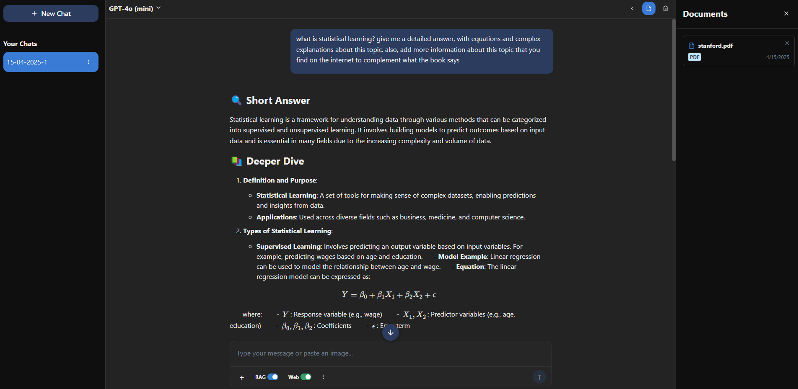
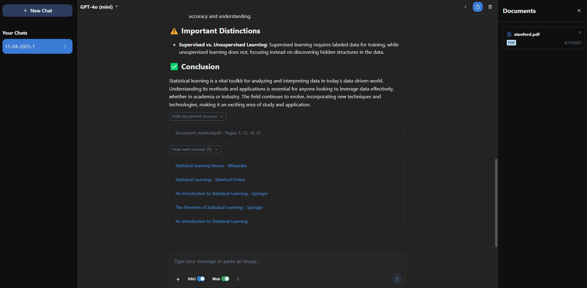

# Document-Based Chat Application: AI Chatbot with Document Management, Markdown and LaTeX Support

A powerful chat application that allows users to have intelligent conversations with their documents. Built with FastAPI, React, Langchain, ChromaDB, and OpenAI embeddings, this application enables natural language interactions with PDF files through an elegant, user-friendly interface. The results from the images bellow are using gpt-4o-mini.






## Features

### Document Management
- **Document Upload**: Easily upload PDF documents through the interface
- **Document Persistence**: Uploaded documents remain available between sessions
- **Document Deletion**: Remove documents from the system with a simple click
- **Document Listing**: View all available documents in the side panel

### Intelligent Chat
- **Contextualized Responses**: The AI analyzes documents to provide accurate answers
- **Retrieval Augmented Generation (RAG)**: Toggle RAG on/off to control whether the AI uses documents
- **Chat Sessions**: Create and manage multiple chat sessions
- **Conversation History**: Full chat history is preserved within each session

### Rich Text Support
- **Markdown Rendering**: Format messages with standard markdown syntax
- **Code Highlighting**: Beautiful syntax highlighting for code blocks
- **LaTeX Support**: Render mathematical formulas using LaTeX notation
- **Source References**: View document references for AI-generated responses

### User Experience
- **Responsive Design**: Works seamlessly across different screen sizes
- **Dark Mode**: Easy on the eyes for extended usage
- **Real-time Feedback**: Status indicators for operations like uploads and deletions
- **Scroll Management**: Convenient scroll-to-bottom button for long conversations

### In Development
- **Web Search**: Integration with web search capabilities
- **Enhanced Document Support**: Support for various file formats including Excel, CSV, and DOCX
- **Isolated Vector Databases**: Separate vector databases for each chat session
- **Chat Renaming**: Ability to rename chat sessions for better organization

## Architecture

The application is structured as a client-server system:

### Backend (FastAPI)
- **Document Processing**: Extracts text from PDFs and creates vector embeddings
- **Vector Database**: Stores document embeddings for semantic search using ChromaDB
- **Chat Management**: Handles chat sessions, history, and AI interactions
- **File Management**: Manages document storage and retrieval

### Frontend (React)
- **Context Providers**: Manages global state for chat and documents
- **Component Structure**: Modular components for each section of the interface
- **Hooks and Effects**: Manages side effects and component lifecycle
- **Chat Rendering**: Specialized components for rendering different message types

### Data Flow
1. User uploads PDFs to the system
2. PDFs are processed into text chunks and vectorized
3. When a question is asked, the system finds relevant document sections
4. The AI model combines the retrieved context with the chat history
5. The model generates a response that's displayed to the user

## Technology Stack

- **Backend**:
  - FastAPI: High-performance Python web framework
  - Langchain: Framework for LLM application development
  - ChromaDB: Vector database for document embeddings
  - OpenAI Embeddings: For creating vector representations of text
  - PyPDF Loader: PDF text extraction utility

- **Frontend**:
  - React: UI library for building the interface
  - Chakra UI: Component library for styling
  - React Markdown: For rendering markdown content
  - KaTeX: For rendering mathematical formulas
  - React Syntax Highlighter: For code block formatting

## Usage Guide

### Uploading Documents
1. Click the "+" button in the chat input area
2. Select one or more PDF files from your computer
3. Files will be processed and appear in the documents panel

### Managing Documents
1. Click the documents icon in the top-right to view uploaded files
2. Click the "X" on any document card to delete it
3. When a document is deleted, it is removed from both the file system and the vector database

### Chat Interactions
1. Start chatting immediately - no document upload required to begin
2. Type your question in the chat input and press Enter or click the send button
3. The RAG toggle in the interface is currently a UI element only (backend implementation coming soon)
4. For mathematical formulas, use LaTeX syntax: `$E = mc^2$` for inline math or `$$E = mc^2$$` for block math
5. Use markdown for formatting: **bold**, *italic*, `code`, etc.

### Chat Sessions
1. Use the sidebar to create new chat sessions
2. Switch between different conversations while maintaining context
3. Delete conversations you no longer need
4. Chat renaming functionality will be implemented in a future update

## Project Structure

```
├── app/
│   ├── main.py                 # FastAPI application entry point
│   ├── utils/
│   │   ├── chatbot.py          # AI chat logic
│   │   ├── prepare_vectordb.py # Document embedding and vector operations
│   │   ├── save_chat.py        # Chat history persistence
│   │   ├── save_docs.py        # Document storage utilities
│   │   └── session_state.py    # Session management
│   └── chat_sessions/          # Stored chat sessions
├── chatbot-frontend/
│   ├── components/
│   │   ├── ChatArea.js         # Main chat interface
│   │   └── ...                 # Other UI components
│   ├── context/
│   │   └── ChatContext.js      # Global state management
│   └── ...                     # React app configuration
├── docs/                       # Uploaded PDF files
└── Vector_DB - Documents/      # ChromaDB vector database
``` 
